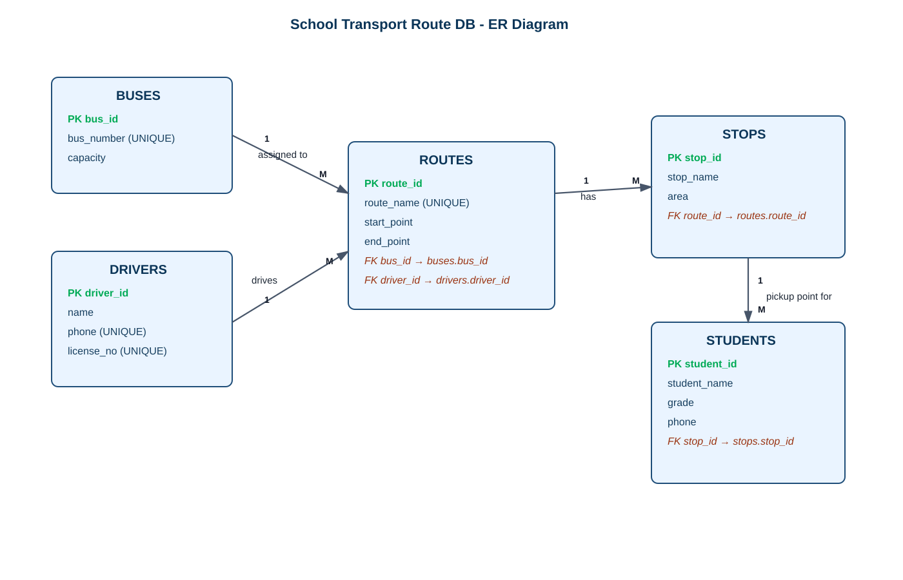

# School Transport Route DBMS Mini Project

A complete beginner-friendly DBMS mini project using **MySQL + Python Flask**.

---

## Project Description
This project is a web-based database management system for school transport operations. It helps school admins manage buses, drivers, routes, stops, and student transport allocations from one dashboard. The application demonstrates relational modeling, foreign-key integrity, CRUD operations, and SQL JOIN-based reporting in a practical real-world scenario.

### Key Features
- Manage buses and driver records.
- Assign buses and drivers to routes.
- Add route-wise stops and map students to pickup stops.
- View transport reports with JOINs and route-wise student counts.
- Maintain data integrity using primary keys, unique constraints, and foreign keys.

### ER Diagram (Generated Image)


---

## 1) Problem Statement
Schools often manage transport records manually, causing route confusion, student pickup errors, and poor bus/driver utilization. This project digitizes the process by tracking buses, drivers, routes, stops, and student allocations in one relational database with a simple web interface.

---

## 2) Tech Stack (Fast + Practical)
- Database: MySQL
- Backend: Python Flask
- Frontend: HTML + Bootstrap
- DB Connector: mysql-connector-python

---

## 3) ER Diagram (How to Draw)
Use these entities and relationships:

### Entities
1. **Buses**(`bus_id`, `bus_number`, `capacity`)
2. **Drivers**(`driver_id`, `name`, `phone`, `license_no`)
3. **Routes**(`route_id`, `route_name`, `start_point`, `end_point`, `bus_id`, `driver_id`)
4. **Stops**(`stop_id`, `stop_name`, `area`, `route_id`)
5. **Students**(`student_id`, `student_name`, `grade`, `phone`, `stop_id`)

### Relationships
- One **Bus** can be assigned to many **Routes** (1:M)
- One **Driver** can be assigned to many **Routes** (1:M)
- One **Route** has many **Stops** (1:M)
- One **Stop** has many **Students** (1:M)

Draw rectangles for entities, ovals for attributes, and diamonds/labels for relationships with cardinalities above.

---

## 4) Database Schema (Tables, Keys)
See full SQL in `sql/schema.sql`.

- PKs: `bus_id`, `driver_id`, `route_id`, `stop_id`, `student_id`
- FKs:
  - `routes.bus_id -> buses.bus_id`
  - `routes.driver_id -> drivers.driver_id`
  - `stops.route_id -> routes.route_id`
  - `students.stop_id -> stops.stop_id`

---

## 5) Normalization (1NF, 2NF, 3NF)

### 1NF
- All attributes are atomic.
- No repeating groups (e.g., multiple stops in one cell).

### 2NF
- Every non-key attribute fully depends on whole primary key.
- Since each table mostly has a single-column PK, partial dependency is avoided.

### 3NF
- No transitive dependencies.
- Example: Driver details are in `drivers`, not in `routes` repeatedly.
- Bus details are in `buses`, not duplicated in `students`.

---

## 6) Terminal Setup in VS Code (from Empty Folder)

```bash
# 1) Create project folder
mkdir school-transport-dbms
cd school-transport-dbms

# 2) Create virtual environment
python -m venv venv

# 3) Activate venv (Windows PowerShell)
venv\Scripts\Activate.ps1

# 4) Install packages
pip install flask mysql-connector-python

# 5) Create folders/files
mkdir templates static sql
# Linux/macOS:
touch app.py db.py requirements.txt README.md
# Windows cmd alternative:
# type nul > app.py && type nul > db.py && type nul > requirements.txt && type nul > README.md

# 6) Save installed packages
pip freeze > requirements.txt
```

---

## 7) Database Setup Commands

```bash
# Login to MySQL
mysql -u root -p

# Run schema
source sql/schema.sql;

# Insert sample data
source sql/sample_data.sql;
```

> If `source` fails, use full absolute path to SQL files.

---

## 8) Run Project

```bash
pip install -r requirements.txt
python app.py
```

Open browser: `http://127.0.0.1:5000`

Run tests:

```bash
pytest
```

---

## 9) CRUD + SQL Query Coverage

### CREATE
- Insert buses, drivers, routes, stops, students through forms.

### READ
- Dashboard counts and list tables.
- JOIN reports in students page.

### UPDATE (SQL example)
```sql
UPDATE buses SET capacity = 42 WHERE bus_id = 1;
```

### DELETE
- Delete buttons in UI (implemented using **POST** for safer deletion).

### SELECT with JOIN
```sql
SELECT st.student_name, st.grade, sp.stop_name, r.route_name, b.bus_number, d.name AS driver_name
FROM students st
JOIN stops sp ON st.stop_id = sp.stop_id
JOIN routes r ON sp.route_id = r.route_id
JOIN buses b ON r.bus_id = b.bus_id
JOIN drivers d ON r.driver_id = d.driver_id;
```

---

## 10) Project Structure

```text
schooltransportroutedb/
├── app.py
├── db.py
├── requirements.txt
├── sql/
│   ├── schema.sql
│   └── sample_data.sql
├── static/
│   └── style.css
├── tests/
│   └── test_app.py
└── templates/
    ├── base.html
    ├── index.html
    ├── buses.html
    ├── drivers.html
    ├── routes.html
    ├── reports.html
    ├── stops.html
    └── students.html
```

---

## 11) Output Screenshot Description (for Report)
Use these headings when adding screenshots in report:
1. **Dashboard**: Shows total students, buses, routes, and drivers.
2. **Bus Management**: Add bus form and list of buses.
3. **Driver Management**: Add driver form and list.
4. **Route Management**: Assign bus + driver to route.
5. **Stop Management**: Add stops route-wise.
6. **Student Management**: Allocate student to stop and view route/bus via JOIN.
7. **Reports Page**: Route-wise student count and complete student allocation report.

---

## 12) Common Mistakes (Important)
- Wrong MySQL username/password in `db.py`.
- Forgetting to run `schema.sql` before app start.
- Deleting parent rows with child rows (FK restrictions).
- Not activating virtual environment before package install.

---

## 13) Viva Questions with Answers

1. **Why DBMS for this project?**
   - To manage transport data centrally with integrity and fast retrieval.

2. **What are primary and foreign keys here?**
   - PK uniquely identifies rows; FK creates relation across tables.

3. **Why normalization?**
   - To reduce redundancy and anomalies.

4. **Which normal form is achieved?**
   - Up to 3NF.

5. **What is a JOIN?**
   - Query combining rows from multiple related tables.

6. **Difference between DELETE and DROP?**
   - DELETE removes rows; DROP removes complete table structure.

7. **Why use Flask?**
   - Lightweight, beginner-friendly, fast for CRUD web apps.

8. **How do you enforce data consistency?**
   - Using constraints: PK, FK, UNIQUE, CHECK.

9. **What happens if a referenced FK value is missing?**
   - Insert/update fails with FK constraint error.

10. **How can this project be extended?**
   - GPS tracking, attendance, notifications, fee integration.

---

## 14) Fast Demo Script (2 minutes)
1. Add one bus.
2. Add one driver.
3. Create one route linked to bus+driver.
4. Add one stop to route.
5. Add one student to stop.
6. Show student list with route and bus details (JOIN proof).

This is enough to impress evaluators quickly.
